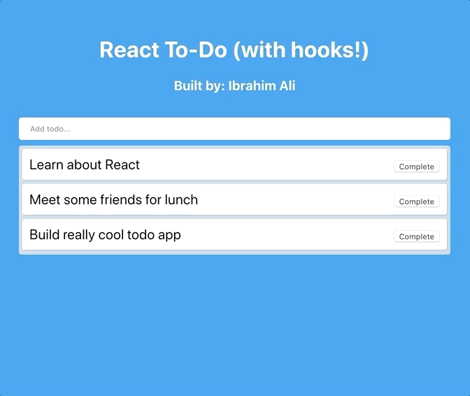

# React To-Do

## What is this?

### A simple React to-do application that I built to understand how hooks work

## What are hooks?

From my understanding, **hooks allow developers to build out functional components with state**. This is extremely useful because previously, one could only incorporate state via class-based components. Hooks reduce code complexity and make workflow much more efficient within React apps.

Read more about hooks in the official [React documentation](https://reactjs.org/docs/hooks-intro.html)

## How to use hooks

Essentially, all we to do is import `useState` from React at the top of our JS file. Then, within the component, declare state with the following syntax:

`const [value, setValue] = useState([1,2,3]);`

- `value` is used to access state. For example: `
{value[0]}
` would render a 1
- `setValue` is used to change the state. For example: `setValue("something else")` would change value to the string "something else"
- We can declare multiple lines of these useState consts for numerous state values
- We can define the variables for these 'getters' and 'setters' however we please. Value doesn't have to be value, it can be val, v, or whatever you want. Ideally, it describes the stateful variable we're working with
